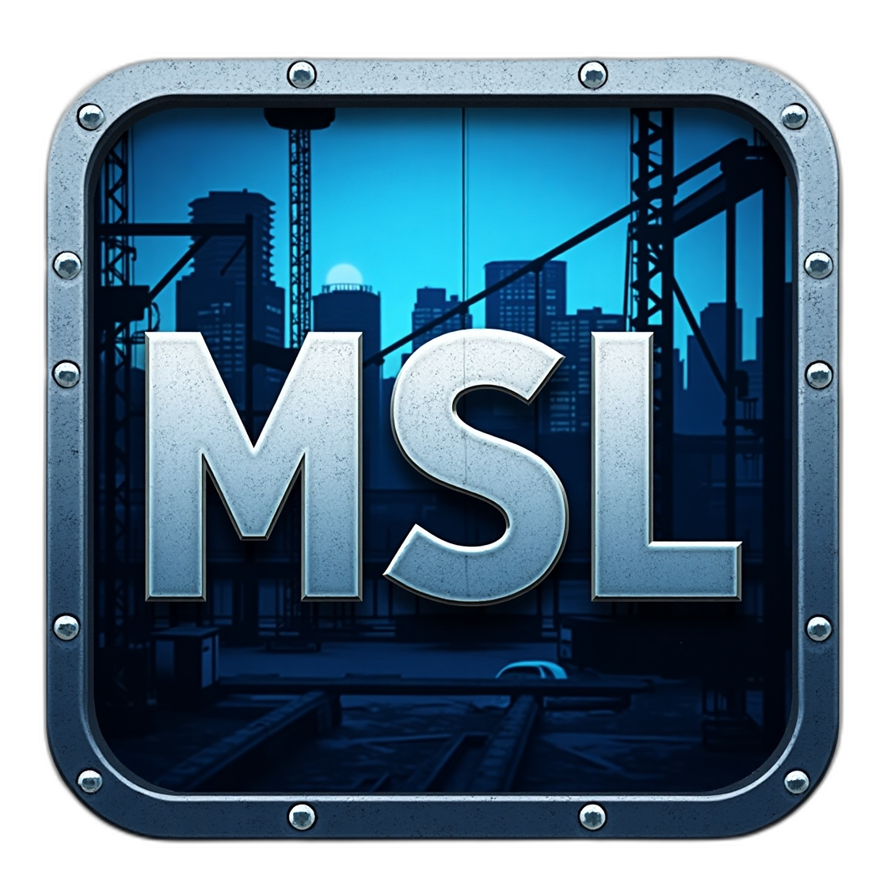

<div align="center">
    
    <h2>MultiSkyLine</h2>
    <h4>Multiplayer mod for Cities: Skylines</h4>
    
</div>

---

> ⚠️ **MSL is currently in development and not ready for public use.**

## MultiSkyLine

**MSL (MultiSkyLine)** is a mod designed to bring an **indirect multiplayer experience** to _Cities: Skylines_.  
Each player manages their own city **independently**, while still being able to **trade resources** with others.

### What MSL Offers
✔ **Resource Trading** – Exchange electricity, water, services, and more.  
✔ **Collaborative Economy** – Help friends in need or optimize global resource distribution.  
✔ **Seamless Integration** – Keep the classic city-building experience while adding multiplayer interaction.

---

## Planned Features
- ✅ **Basic resource trading** (electricity, water, services)
- 🚧 **Dynamic economy system** (pricing, supply & demand)
- 🔄 **Real-time data sync between players**
- 📊 **UI enhancements for better tracking of exchanges**

---
## Development & Contribution

This section explains how to set up your environment to contribute to the mod's development.

### Locate the Mod Directory
1. Open the `Run` utility (`Win + R`) and type:
   ```
   %localappdata%
   ```
2. Navigate to:
   ```
   Colossal Order\Cities_Skylines\Addons\Mods
   ```
3. Create a new folder named **`MSL`** (if it does not exist).
4. Copy all built `.dll` files to:
   ```
   Colossal Order\Cities_Skylines\Addons\Mods\MSL
   ```

### Setup Your Environment
You **must have the game installed locally** to develop and test the mod.

1. Locate the **game installation directory**. Example:
   ```
   C:\steamapps\common\Cities_Skylines\
   ```
   We will refer to this path as:
   ```
   /path/to/cs
   ```

2. **Create an environment variable** for the game path:
    - Open **System Properties** → `Advanced system settings` → `Environment Variables`
    - Create a new variable:
      ```
      Name: CitiesSkylinesGameDir
      Value: /path/to/cs
      ```

### Building & Running the Mod
1. Clone the repository:
   ```sh
   git clone https://github.com/apavarino/MultiSkyLine.git
   cd MSL
   ```
2. Open the project in **Rider** or **Visual Studio**.
3. Build the project.
4. Copy the built `.dll` files to the mod directory (`Addons/Mods/MSL`).
5. Start **Cities: Skylines** and enable MSL in the mod manager.

---
## License & Credits
This project is open-source under the **MIT License**.  
Contributions are welcome! Feel free to open issues or pull requests.

